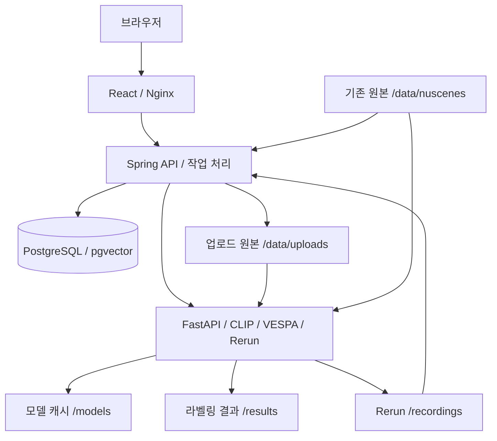

# DriveScene2Label

nuScenes 원본을 등록하고, 카메라 이미지 임베딩으로 자연어 씬 검색과 VESPA 3D 자동 라벨링을 수행하는 웹 앱입니다.
React 프론트, Spring 백엔드, FastAPI AI 서버, PostgreSQL/pgvector로 구성합니다.

이 문서는 **`gpu_local` 브랜치의 로컬 NVIDIA GPU 실행 환경**을 기준으로 합니다.
변경사항은 이 브랜치에만 push하며, main 병합이나 PR 생성은 별도로 진행해야 합니다.

## 이번 변경사항 (2026-10-06)

- 웹에서 nuScenes 폴더 업로드 → 원본 영구 저장 → 메타데이터 DB 등록 → 카메라 키프레임 임베딩을 순서대로 처리합니다.
- 업로드 파일 수, DB 등록 단계, 임베딩 완료 수와 실패 상태를 표시합니다. 기존 데이터셋도 임베딩을 생성하고 누락분을 이어서 처리할 수 있습니다.
- 업로드 원본은 `dataset_uploads` 볼륨에, 파일 경로·메타데이터·벡터·처리 상태는 PostgreSQL에 저장합니다.
- 업로드한 데이터셋을 로컬 VESPA 라벨링과 Rerun 내보내기에서도 사용합니다.
- 프론트 Docker 이미지와 `compose.web.yml`, `scripts/dev.sh`를 추가해 프론트·백엔드·AI·DB를 함께 실행합니다.
- 기존 씬 탐색, 6카메라·LiDAR 확인, GT/예측 표시, 두 씬 비교 기능을 유지합니다.

## 처음 실행하기 — Windows + Ubuntu WSL

Docker Desktop을 실행하고 Ubuntu WSL 통합과 NVIDIA GPU 지원을 준비합니다.
최초 빌드와 모델 다운로드에는 인터넷 연결과 충분한 디스크 공간이 필요합니다.

Windows CMD 또는 PowerShell에서 Ubuntu로 들어갑니다.

```text
wsl -d Ubuntu
```

이후 명령은 **Ubuntu 터미널**에서 실행합니다. 아래 clone은 새로 설치할 때만 사용합니다.

```bash
git clone --branch gpu_local --single-branch https://github.com/leehyeoksu/DriveScene2Label.git
cd DriveScene2Label
bash scripts/dev.sh setup
bash scripts/dev.sh up
```

기존 저장소에서는 `compose.yml`과 `scripts/`가 있는 프로젝트 루트로 이동한 뒤 실행합니다.
`setup`은 `.env`가 없을 때만 예시를 복사하고 임의 DB 비밀번호를 생성합니다.
기존 `.env`는 덮어쓰지 않습니다. Docker 실행에는 호스트 Python 가상환경 활성화가 필요 없습니다.

웹 접속: **[http://localhost:3000](http://localhost:3000)**

새 설치는 빈 데이터셋으로 시작합니다. 웹의 **데이터 업로드 · 검색 준비**에서 nuScenes 폴더를 등록합니다.
AI 모델이 처음 로딩되는 동안 검색·임베딩은 준비 중일 수 있습니다.
컨테이너의 Started 표시만으로 실제 추론 완료를 판단하지 않습니다.

## 프론트·백엔드·통합 실행 명령

모든 명령은 프로젝트 루트에서 실행합니다.

| 목적 | 명령 | 포함 서비스 / 주소 |
|---|---|---|
| 프론트·백엔드 통합 빌드 및 실행 | `bash scripts/dev.sh up` | frontend, backend, ai-server(GPU), db |
| 백엔드 실행 | `bash scripts/dev.sh backend` | backend, ai-server(GPU), db |
| 프론트 실행 | `bash scripts/dev.sh frontend` | frontend만 빌드·실행, 백엔드는 먼저 실행 |
| 기존 이미지로 다시 실행 | `bash scripts/dev.sh start` | 전체 서비스 |
| 상태 확인 | `bash scripts/dev.sh status` | 컨테이너 상태 |
| 로그 보기 | `bash scripts/dev.sh logs` | Ctrl+C는 로그 보기만 종료 |
| 전체 종료 | `bash scripts/dev.sh stop` | 컨테이너 중지, 데이터 유지 |

스크립트의 통합 실행과 같은 직접 명령:

```bash
docker compose -f compose.yml -f compose.gpu.yml -f compose.web.yml up --build -d
```

`compose.yml`만 사용하면 프론트와 GPU 할당이 포함되지 않습니다.
`compose.gpu.yml`은 AI 서버에 NVIDIA GPU를 할당하고,
`compose.web.yml`은 프론트를 추가합니다.

프론트 소스 변경을 즉시 반영하려면 호스트 Node 22 환경에서 실행합니다.

```bash
bash scripts/dev.sh backend
bash scripts/dev.sh frontend-dev
```

개발 웹 주소는 [http://localhost:5173](http://localhost:5173)입니다.
Docker 프론트(3000)와 개발 프론트(5173)는 실행 방식이 다릅니다.
VESPA 작업 중 이미지 재빌드 후 서버를 재생성하면 실행이 끊길 수 있으므로 완료 후 적용합니다.

## 데이터 업로드와 임베딩

압축을 푼 nuScenes 루트 폴더를 선택합니다. 버전 메타데이터 폴더 자체를 선택하지 않습니다.

```text
nuscenes/
├── samples/
├── sweeps/
├── maps/
└── v1.0-mini/             # 또는 v1.0-trainval/
    ├── scene.json
    ├── sample.json
    ├── sample_data.json
    ├── sample_annotation.json
    └── ...               # 전체 메타데이터 JSON
```

1. 웹에서 이름·버전·출처를 지정하고 폴더를 업로드합니다.
2. 서버가 원본을 영구 저장하고 메타데이터·참조 경로·DB 관계를 검증합니다.
3. 데이터셋을 DB에 등록한 뒤 카메라 키프레임의 CLIP 벡터를 생성합니다.
4. 검색 준비 완료 후 자연어로 씬을 검색하고, 씬을 선택해 VESPA 라벨링이나 Rerun 내보내기를 실행합니다.

개별 JPG나 동영상만으로 씬을 만들지는 않습니다. 메타데이터가 참조하는 원본 파일이 필요합니다.
파일당 최대 512MB, 업로드당 기본 128GiB 한도이며 서버의 `uploads.max-bytes` 설정으로 전체 한도를 조정할 수 있습니다.
업로드 중에는 탭을 유지해야 합니다. 업로드 완료 후 DB 등록·임베딩은 서버에서 계속됩니다.

기존 등록 데이터는 **현재 데이터셋 임베딩 생성**을 사용합니다.
동일 모델·전처리로 저장한 벡터는 건너뛰고, 실패한 작업은 **이어서 처리**합니다.
단일 backend 환경에서 재시작 시 실행 중이던 데이터 준비 작업을 다시 큐에 넣습니다.
VESPA 라벨링 작업 복구와는 별개입니다.

업로드 데이터의 VESPA는 로컬 실행을 지원합니다.
SSH 실행기는 업로드 파일을 원격으로 자동 전송하지 않습니다.

### 기존 호스트 폴더를 연결하는 경우

웹 업로드 대신 이미 저장한 nuScenes 폴더를 연결하려면 `.env`를 설정합니다.

```dotenv
NUSCENES_HOST_PATH=/absolute/path/to/nuscenes
NUSCENES_VERSION=v1.0-mini
NUSCENES_IMPORT_ENABLED=true
NUSCENES_DATA_ORIGIN=NUSCENES
```

출처는 실제 데이터에 맞게 지정합니다(`NUSCENES`, `SYNTHETIC`, `UNKNOWN`).
테스트 fixture를 공식 원본으로 표시하지 않습니다.
설정 후 `bash scripts/dev.sh up`으로 적용합니다.
동일 입력의 반복 import는 건너뛰고, 변경된 메타데이터를 같은 데이터셋에 혼합하지 않습니다.
등록 후 import를 false로 바꿔도 DB 카탈로그는 유지됩니다.
이 경로의 시작 시 import는 메타데이터 등록이므로, 임베딩은 웹에서 별도로 생성합니다.

## 구성과 저장 위치



프론트는 Spring `/api/*`를 호출합니다. Spring이 DB와 작업 상태를 관리하고,
FastAPI는 AI 결과를 반환합니다. 이미지 원본 바이트를 DB에 넣지는 않습니다.

| 서비스 | 호스트 기본 주소 | 컨테이너 내부 주소 |
|---|---|---|
| frontend | [http://localhost:3000](http://localhost:3000) | frontend:80 |
| backend | [http://localhost:8080](http://localhost:8080) | backend:8080 |
| ai-server | [http://localhost:8000](http://localhost:8000) | ai-server:8000 |
| db | localhost:55433 | db:5432 |

| 저장 공간 | 내용 / 접근 |
|---|---|
| `postgres_data` | DB 메타데이터, 임베딩, 작업 상태, GT·예측 박스 |
| `dataset_uploads` → `/data/uploads` | 업로드 원본, backend 쓰기 / AI 읽기 |
| 호스트 폴더 → `/data/nuscenes` | 기존 원본, backend·AI 읽기 전용 |
| `model_cache` → `/models` | CLIP, Hugging Face, torch 모델 캐시 |
| `vespa_results` → `/results` | VESPA 결과 JSON, 중간 파일, 실행 로그 |
| `rerun_recordings` → `/recordings` | Rerun 파일, AI 쓰기 / backend 읽기 |

컨테이너끼리는 `localhost` 대신 서비스 이름을 사용합니다.
종료·컨테이너 재생성 시 볼륨은 유지합니다. `down -v`는 DB·업로드 원본·모델·결과 볼륨을 삭제하므로 일반 종료에는 사용하지 않습니다.

## 주요 설정

실제 설정은 Git에서 제외한 `.env`에 둡니다. 전체 예시는 [.env.example](.env.example)입니다.

| 변수 | 기본값 / 의미 |
|---|---|
| POSTGRES_DB / POSTGRES_USER | drivescene |
| POSTGRES_PASSWORD | setup 시 임의 생성, 수동 설정 시 개인 값 사용 |
| NUSCENES_HOST_PATH | ./data/nuscenes; 기존 원본을 연결할 호스트 루트 |
| NUSCENES_VERSION | v1.0-mini |
| NUSCENES_IMPORT_ENABLED | false; 기존 폴더 메타데이터를 시작 시 등록하려면 true |
| NUSCENES_DATA_ORIGIN | UNKNOWN; 기존 폴더 데이터의 실제 출처 |
| WEB_PORT / APP_PORT / AI_PORT / DB_PORT | 3000 / 8080 / 8000 / 55433, 호스트 loopback |
| AI_SERVER_READ_TIMEOUT | .env.example은 120s, Compose fallback은 30s |
| VESPA_TIMEOUT_SECONDS / AUTO_LABEL_READ_TIMEOUT | 7200 / 7300s |
| VESPA_NUM_THREADS | 1; VESPA subprocess의 BLAS/OMP 스레드 수 |
| AUTO_LABEL_WORKER_ENABLED | true |
| RECORDING_TIMEOUT_SECONDS / RECORDING_READ_TIMEOUT | 600 / 660s |
| RECORDING_WORKER_ENABLED | true |
| VESPA_EXECUTOR | local; 원격 실행은 [SSH 안내](ai-server/VESPA_Seraph.md) 참조 |

두 번째 Compose 프로젝트를 실행하면 `WEB_PORT`, `APP_PORT`, `AI_PORT`, `DB_PORT`를 모두 분리합니다.
프로젝트 이름만 바꾸면 볼륨은 분리되지만 호스트 포트는 충돌합니다.
기존 DB 볼륨의 비밀번호는 `.env` 수정만으로 바뀌지 않습니다.
원격 SSH 실행은 별도 Compose 구성이며, 이 문서의 `dev.sh`는 로컬 GPU 구성을 사용합니다.

## GPU·서버 확인과 문제 해결

```bash
bash scripts/dev.sh status
curl --fail http://localhost:8080/api/datasets
curl --fail http://localhost:8080/api/system/status
curl --fail http://localhost:8000/health
docker compose -f compose.yml -f compose.gpu.yml exec ai-server python -c "import torch; print('PyTorch:', torch.__version__); print('CUDA:', torch.cuda.is_available()); print('GPU:', torch.cuda.get_device_name(0) if torch.cuda.is_available() else 'unavailable')"
docker compose -f compose.yml -f compose.gpu.yml exec ai-server nvidia-smi
```

`CUDA: True`는 컨테이너에서 GPU에 접근할 수 있다는 뜻입니다.
추론 중 실제 GPU 사용은 `nvidia-smi`와 AI 로그로 확인합니다.
준비 상태 확인은 VESPA 전체 추론 성공을 보장하지 않습니다.

| 증상 | 확인할 내용 |
|---|---|
| compose.yml 또는 package.json 없음 | 저장소 루트로 이동. 프론트 npm 명령은 frontend 폴더에서 실행 |
| docker --version은 되지만 실행 실패 | `docker version`에서 Server 연결 확인, Docker Desktop과 Ubuntu WSL 통합 확인 |
| 웹에서 HTTP 502 | backend·ai-server 상태와 로그, 포트·프록시 대상 확인 |
| 씬 목록은 있지만 검색 결과 없음 | 해당 데이터셋의 카메라 키프레임 임베딩 생성 여부 확인 |
| CUDA False | GPU Compose 파일 적용 여부와 호스트 NVIDIA/Docker GPU 지원 확인 |
| AI health 503 | 최초 CLIP 다운로드·로딩 또는 실패 로그 확인; 다른 기능은 별도 상태 확인 |
| VESPA RUNNING이 오래 유지 | 실제 프로세스·GPU·실행 로그 확인. 진행 퍼센트를 제공하지 않으며 멈췄다고 단정하지 않음 |
| 서버 종료 후 VESPA 작업이 RUNNING | 자동 복구/lease 제약은 [운영 복구 절차](docs/operations-recovery.md) 참조 |

검색 점수는 CLIP 이미지·문장 벡터의 코사인 유사도이며 정확도 퍼센트가 아닙니다.
씬별 상위 이미지 점수를 평균 내어 순위를 정하므로 같은 질의의 결과를 비교하는 데 사용합니다.

## 모델과 Git 제외 정책


모델 가중치, 데이터셋, DB 파일, 결과 JSON/NPZ, 로그, Python venv, `.env`는 Git에 올리지 않습니다. `.gitignore`와 Docker build allowlist를 적용합니다. 기존 `embedding/fixtures/*.npz`는 작은 테스트 기준 벡터만 예외입니다.

|역할|모델/소스|다운로드 및 저장|
|---|---|---|
|CLIP|[OpenCLIP](https://github.com/mlfoundations/open_clip), ViT-L-14-quickgelu / openai|서버 시작 시 open_clip이 다운로드, `/models/huggingface`|
|VESPA source|[TUMFTM/VESPA](https://github.com/TUMFTM/VESPA), commit `acb2b6e8683363795528f049fe0444ef9f3efdb9`|Docker build에서 `/opt/vespa`에 clone|
|Grounding DINO|[IDEA-Research/grounding-dino-base](https://huggingface.co/IDEA-Research/grounding-dino-base)|첫 VESPA 사용 시 Hugging Face cache|
|SAM ViT-base|[facebook/sam-vit-base](https://huggingface.co/facebook/sam-vit-base)|첫 VESPA 사용 시 Hugging Face cache|
|DINOv2|[facebookresearch/dinov2](https://github.com/facebookresearch/dinov2), `dinov2_vitb14_reg`|torch.hub 다운로드, `/models/torch`|

각 모델/데이터의 라이선스와 사용 조건은 원본 링크를 따릅니다. VESPA 설정은 `/opt/vespa/configs/vlm/p_final.yaml`이며 실제 설정은 DINOv2 **register variant**입니다. 모델 캐시는 컨테이너 재생성 시 유지됩니다. 가중치를 이미지 layer에 굽지 않습니다. 첫 VESPA 요청에는 다운로드 시간이 포함될 수 있으므로 운영 전 사전 준비/연결 확인이 필요합니다.

Markdown 문서와 실행 설정은 추적합니다. 문서의 DOCX 출력본은 로컬에 보관합니다.
`docs/images/`의 명시한 설명 그림과 `embedding/fixtures/*.npz` 테스트 기준 벡터만 미디어/배열 제외 규칙의 예외입니다.
`.gitignore`는 이미 추적 중인 파일을 자동으로 제거하지 않으므로 커밋 전 목록을 확인합니다.

## API와 DB

전체 기존 REST 계약은 [README_API.md](README_API.md)를 참조합니다.
새 데이터 준비 흐름은 아래 순서입니다.

| 요청 | 역할 |
|---|---|
| `POST /api/dataset-ingestions` | 업로드 세션 생성 |
| `POST /api/dataset-ingestions/{id}/files` | 파일별 multipart 업로드: path, file |
| `POST /api/dataset-ingestions/{id}/complete` | fileCount를 전달하고 DB 등록·임베딩 시작 |
| `GET /api/dataset-ingestions` | 처리 상태 조회 |
| `POST /api/dataset-ingestions/{id}/retry` | 실패 작업 이어서 처리 |
| `GET /api/datasets/{id}/index` | 기존 데이터셋 임베딩 범위 조회 |
| `POST /api/datasets/{id}/index` | 기존 데이터셋 임베딩 생성 |
| `GET /api/search/scenes?q=cloudy&k=10` | 자연어 씬 검색 |
| `POST /api/auto-label/jobs` | VESPA 작업 생성 |

Flyway V1~V7이 카탈로그, 벡터, 씬 조건, 라벨링, Rerun, 출처·오류 코드, 업로드 작업 테이블을 관리합니다.
기존 적용 migration을 수정하지 않고 새 migration을 추가합니다.
원본 GT와 VESPA 예측은 분리 저장하며, 라벨링 완료 결과는 검증 후 트랜잭션으로 저장합니다.
DB 스키마는 [결과 스키마](docs/auto-label-result-schema.md), Rerun 계약은 [recording 문서](docs/rerun-recording.md)를 참조합니다.

## 개발과 검증

프론트는 Node 22를 권장합니다. 프로젝트 의존성과 버전은 [frontend/package.json](frontend/package.json),
AI 의존성은 [CLIP requirements](ai-server/requirements.txt)와 [VESPA requirements](ai-server/requirements-vespa.txt)를 기준으로 합니다.
백엔드는 Java 21 / Spring Boot / Gradle Wrapper, DB는 PostgreSQL 16 / pgvector를 사용합니다.

```bash
# 프로젝트 루트: 별도 테스트 DB를 띄워 backend 테스트
bash scripts/docker-test.sh

# frontend 폴더: 설치·검사·테스트·빌드
cd frontend
npm ci
npm run typecheck
npm test
npm run build
```

AI 테스트는 pytest/httpx가 설치된 환경에서 `(cd ai-server && python -m pytest -q tests)`로 실행합니다.
`scripts/docker-smoke.py`는 실행 중인 서버에 임베딩을 저장하며,
`--auto-label`을 추가하면 실제 VESPA 작업을 생성하므로 단순 상태 점검과 구분합니다.

2026-10-06 로컬 확인 기록:

- backend 전체 36개 테스트와 업로드/임베딩 관련 추가 확인 통과.
- frontend 60개 테스트, 타입 검사, 프로덕션 빌드 통과.
- AI 기존 56개 테스트와 업로드 미디어 관련 테스트 확인.
- backend·AI·frontend Docker 이미지 빌드, 프론트 API 프록시, 업로드 볼륨 쓰기 권한 확인.
- 기존 mini 데이터셋의 카메라 키프레임 임베딩 2,424/2,424개 저장과 씬 검색 확인.

이 기록은 새 PC의 모든 환경과 업로드 데이터셋 전체 VESPA 추론 성공을 보장하는 결과는 아닙니다.
실제 추론 이력·제약은 [Docker 통합 검증](docs/docker-integration.md)과 [통합 테스트 범위](docs/integration-verification.md)를 함께 확인합니다.

## 관련 문서

- [프론트 실행·구조](frontend/README.md)
- [프론트 기획서](docs/frontend-product-plan.md) / [구현 체크리스트](docs/frontend-implementation-checklist.md)
- [실제 데이터 연동 기획서](docs/frontend-integration-plan.md) / [검증 체크리스트](docs/frontend-integration-checklist.md)
- [I1/I2 검토 기록](docs/frontend-integration-audit-2026-10-06.md)
- [VESPA 실행 환경](ai-server/VESPA.md) / [Rerun exporter](ai-server/RECORDING.md)
- [기존 batch embedding 안내](docs/legacy-catalog-and-embedding.md)
- [개발 지침](CLAUDE.md)
- 초기 학습 기록(2026-10-01): [개발 환경·구조](docs/development-environment-and-architecture.md), [Docker 학습 가이드](docs/docker-study-guide.md). 현재 실행은 위 안내를 사용합니다.
