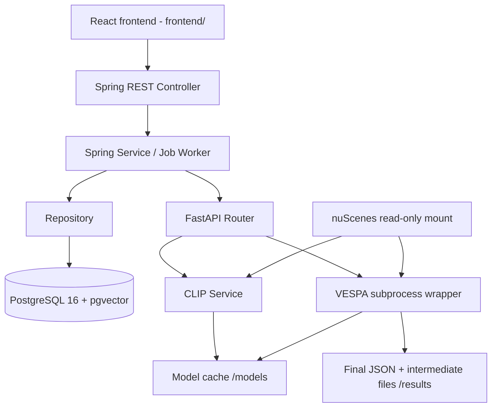

# DriveScene2Label

nuScenes 기반 **3D Auto-Labeling + 자연어 Scene Retrieval** 백엔드입니다. 카메라 이미지를 CLIP 벡터로 저장하고 자연어로 scene을 검색합니다. 선택한 scene은 VESPA로 3D pseudo-label을 생성하여 GT와 분리해 저장합니다.

- [프론트엔드 REST API 명세](README_API.md)
- [DB / VESPA 결과 스키마](docs/auto-label-result-schema.md)
- [통합 검증 및 테스트 범위](docs/integration-verification.md)
- [Docker 검증 결과와 배포 제약](docs/docker-integration.md)
- [프론트엔드 개발 기획서](docs/frontend-product-plan.md)
- [프론트 구현 체크리스트](docs/frontend-implementation-checklist.md)
- [Claude Code 구현 시작 프롬프트](docs/claude-code-frontend-prompt.md)
- [Rerun recording 계약](docs/rerun-recording.md)
- [프론트 실행·구조](frontend/README.md)
- [실제 데이터·프론트 연동 개선 기획서](docs/frontend-integration-plan.md) / [개선 체크리스트](docs/frontend-integration-checklist.md)
- [작업·recording 운영 복구 절차](docs/operations-recovery.md)
- [실제 데이터·프론트 연동 개선 기획서](docs/frontend-integration-plan.md)
- [개선 구현·실제 성공 검증 체크리스트](docs/frontend-integration-checklist.md)
- [Claude Code 연동 업데이트 프롬프트](docs/claude-code-integration-prompt.md)

React 프론트는 [`frontend/`](frontend/README.md)에 있습니다(씬 탐색·검색, 6카메라 작업대, 이미지 위 GT/예측 투영, VESPA 작업, 두 씬 비교, Rerun 3D). 디자인 기준은 `docs/frontend-design/`, 저장소 개발 지침은 [CLAUDE.md](CLAUDE.md), 진행·검증 상태는 [구현 체크리스트](docs/frontend-implementation-checklist.md)를 따릅니다. 실제 nuScenes mini·GPU 환경에서의 통합 확인 범위는 체크리스트의 검증 기록에 따로 적습니다.

## 1. Architecture



Spring은 Controller→Service→Repository 구조로 요청 검증, 데이터 저장/검색, job 상태를 관리합니다. FastAPI Router는 Spring Controller, AI Service는 추론 업무 Service에 대응합니다. FastAPI에는 DB driver/Repository가 없습니다. JSON 응답을 받은 Spring만 DB에 저장합니다.

AI 컨테이너에서 CLIP은 기본 Python, VESPA는 `/opt/vespa-env/bin/python`으로 실행합니다. 큰 PyTorch 설치는 공유하고 VESPA가 요구하는 NumPy/Transformers 등은 별도 환경으로 분리합니다. VESPA source는 Docker build 때 고정 commit을 checkout하며 upstream 파일을 수정하지 않습니다. OpenPCDet 모델 학습은 이 이미지의 대상이 아닙니다. 원본의 `np.bool` 사용은 subprocess에서만 호환 alias로 처리합니다. Python3.12 빌드 호환성을 위해 nuScenes devkit은 upstream Dockerfile의1.1.11 대신1.2.0을 사용합니다.

## 2. Tech Stack

|구분|구성|
|---|---|
|Backend|Java21, Spring Boot4.1.1, Spring Data JDBC, JdbcClient, Flyway|
|AI|Python3.12, FastAPI, PyTorch, OpenCLIP, VESPA-Direct|
|DB|PostgreSQL16, pgvector vector(768)|
|Infrastructure|Docker Engine/Desktop, Docker Compose v2|
|Dataset|nuScenes mini 또는 trainval|

정확한 Python 버전 pin은 [CLIP requirements](ai-server/requirements.txt), [VESPA requirements](ai-server/requirements-vespa.txt)를 참조합니다.

## 3. Prerequisites

- Linux 또는 Docker Desktop의 WSL2 integration 환경, Docker Compose v2.
- nuScenes 데이터의 로컬 압축 해제본. [공식 다운로드](https://www.nuscenes.org/nuscenes).
- 최초 Docker build 및 모델 다운로드에 인터넷 연결과 충분한 디스크 공간이 필요합니다. PyTorch CUDA 패키지와 Open3D가 커서 image build에 시간이 걸립니다.
- CLIP은 CUDA가 없으면 CPU로 서버 기동/추론할 수 있습니다. CPU에서는 느리고 timeout 조정이 필요할 수 있습니다.
- VESPA의 코드에도 CPU fallback이 있지만 전체 scene 처리 성능은 보장하지 않습니다. 실제 auto-label은 NVIDIA GPU 사용을 권장합니다.
- GPU 사용 시 호스트 NVIDIA 드라이버 및 Docker GPU 지원이 필요합니다. macOS 컨테이너에서는 MPS를 사용할 수 없습니다.

## 4. Dataset Setup

아래 전체 root를 마운트합니다. `v1.0-mini` metadata 디렉터리 자체를 root로 지정하지 않습니다.

```text
/path/to/nuscenes/
├── samples/             # keyframe JPG / pointcloud
├── sweeps/              # intermediate sensors
├── maps/
└── v1.0-mini/
    ├── scene.json
    ├── sample.json
    ├── sample_data.json
    ├── sample_annotation.json
    └── ...              # official complete metadata JSON set
```

Spring metadata importer는 원본 관계/경로를 검증합니다. 같은 입력의 반복 import는 건너뛰고, 변경된 metadata를 같은 dataset에 혼합하지 않습니다. 첫 실행에는 `.env`의 `NUSCENES_IMPORT_ENABLED=true`를 사용합니다. 이후 false로 바꿔도 저장된 catalog는 유지됩니다. trainval은 version 및 데이터 모두 함께 바꿔야 합니다.

## 5. 모델 / 다운로드 / Git 제외 정책

모델 가중치, 데이터셋, DB 파일, 결과 JSON/NPZ, 로그, Python venv, `.env`는 Git에 올리지 않습니다. `.gitignore`와 Docker build allowlist를 적용합니다. 기존 `embedding/fixtures/*.npz`는 작은 테스트 기준 벡터만 예외입니다.

|역할|모델/소스|다운로드 및 저장|
|---|---|---|
|CLIP|[OpenCLIP](https://github.com/mlfoundations/open_clip), ViT-L-14-quickgelu / openai|서버 시작 시 open_clip이 다운로드, `/models/huggingface`|
|VESPA source|[TUMFTM/VESPA](https://github.com/TUMFTM/VESPA), commit `acb2b6e8683363795528f049fe0444ef9f3efdb9`|Docker build에서 `/opt/vespa`에 clone|
|Grounding DINO|[IDEA-Research/grounding-dino-base](https://huggingface.co/IDEA-Research/grounding-dino-base)|첫 VESPA 사용 시 Hugging Face cache|
|SAM ViT-base|[facebook/sam-vit-base](https://huggingface.co/facebook/sam-vit-base)|첫 VESPA 사용 시 Hugging Face cache|
|DINOv2|[facebookresearch/dinov2](https://github.com/facebookresearch/dinov2), `dinov2_vitb14_reg`|torch.hub 다운로드, `/models/torch`|

각 모델/데이터의 라이선스와 사용 조건은 원본 링크를 따릅니다. VESPA 설정은 `/opt/vespa/configs/vlm/p_final.yaml`이며 실제 설정은 DINOv2 **register variant**입니다. 모델 캐시는 컨테이너 재생성 시 유지됩니다. 가중치를 이미지 layer에 굽지 않습니다. 첫 VESPA 요청에는 다운로드 시간이 포함될 수 있으므로 운영 전 사전 준비/연결 확인이 필요합니다.

## 6. Environment Variables

```bash
cp .env.example .env
# 편집기로 .env의 password와 실제 dataset 절대 경로를 설정
```

|변수|기본/의미|
|---|---|
|POSTGRES_DB / POSTGRES_USER|drivescene|
|POSTGRES_PASSWORD|반드시 개인 값으로 변경. 실제 .env는 Git 제외|
|NUSCENES_HOST_PATH|필수, 호스트의 dataset root 절대 경로|
|NUSCENES_VERSION|v1.0-mini; Spring과 VESPA에 동일 적용|
|NUSCENES_IMPORT_ENABLED|example=true, compose 기본false|
|NUSCENES_DATA_ORIGIN|UNKNOWN. import checksum과 함께 기록할 출처: 공식 원본이면 `NUSCENES`, 테스트 fixture면 `SYNTHETIC`. 이름·버전으로 추정하지 않으며 SYNTHETIC이면 VESPA 실행을 막는다|
|APP_PORT / AI_PORT|8080 / 8000, host loopback에만 공개|
|VESPA_NUM_THREADS|1, VESPA subprocess의 BLAS/OMP 스레드 수. CLIP 설정과 독립|
|VESPA_TIMEOUT_SECONDS|7200초 subprocess 상한|
|VESPA_EXECUTOR|local. `ssh`면 원격 Slurm 클러스터에서 실행 (`compose.seraph.yml`, [VESPA_Seraph.md](ai-server/VESPA_Seraph.md))|
|AI_SERVER_READ_TIMEOUT|30s, CPU CLIP 처리에 더 필요한 경우 조정|
|AUTO_LABEL_READ_TIMEOUT|7300s, VESPA timeout보다 길게|
|AUTO_LABEL_WORKER_ENABLED|true, Spring DB polling worker|
|RECORDING_TIMEOUT_SECONDS|600초, Rerun exporter subprocess 상한(ai-server)|
|RECORDING_READ_TIMEOUT|660s, Spring의 `POST /recordings` 대기. exporter 상한 이상으로|
|RECORDING_WORKER_ENABLED|true, Spring recording worker|

컨테이너 내부 고정 경로/주소: Spring DB_URL=`jdbc:postgresql://db:5432/<db>`, AI_SERVER_BASE_URL=`http://ai-server:8000`, NUSCENES_ROOT=`/data/nuscenes`, VESPA_ROOT=`/opt/vespa`, VESPA_OUTPUT_ROOT=`/results`, RECORDING_OUTPUT_ROOT(ai-server)/RECORDING_ROOT(backend)=`/recordings`, HF_HOME=`/models/huggingface`, TORCH_HOME=`/models/torch`. 호스트 localhost를 컨테이너 간 주소로 사용하지 않습니다.

## 7. Quick Start

```bash
git clone https://github.com/leehyeoksu/DriveScene2Label.git
cd DriveScene2Label
cp .env.example .env
# 실제 비밀번호와 NUSCENES_HOST_PATH를 .env에 입력하고 dataset 준비
docker compose up --build -d
docker compose ps
docker compose logs -f ai-server backend
```

기본 명령은 GPU 할당 없이 CPU로 동작합니다. NVIDIA GPU 사용:

```bash
docker compose -f compose.yml -f compose.gpu.yml up --build -d
```

DB healthy 후 backend가 기동합니다(2026-10-05부터 AI는 시작만 기다리고 health를 기다리지 않음). CLIP 다운로드·로딩 중에도 씬 목록·카메라·GT는 쓸 수 있고, 검색/VESPA/recording 준비 여부는 `GET /api/system/status`로 확인합니다. CLIP 로딩이 실패해도 AI 서버는 recording/VESPA를 계속 제공하며 `/health`는 503입니다(이전 fail-fast는 `AI_REQUIRE_CLIP=true`). AI health start period는15분입니다. 모델/네트워크가 준비되지 않으면 이 명령이 모든 기능의 readiness를 보장하지 않습니다. 준비 완료 후에는 컨테이너 재시작으로 모델을 매번 다운로드하지 않습니다.

기존 compose의 서비스명 `app`은 `backend`로 바뀌었습니다. 이전 app 컨테이너가 떠 있다면 현재 포트를 비운 뒤 실행하세요. 기존 `postgres_data` volume 이름은 유지하며 자동 삭제하지 않습니다.

## 8. Services / Volumes / Health

|서비스|호스트|내부|health|
|---|---|---|---|
|backend|127.0.0.1:8080|backend:8080|GET /api/datasets (DB 조회 포함)|
|ai-server|127.0.0.1:8000|ai-server:8000|GET /health|
|db|127.0.0.1:55433|db:5432|pg_isready|

|volume/mount|사용 서비스|내용|
|---|---|---|
|postgres_data|db|PostgreSQL persistent data|
|model_cache → /models|ai-server|CLIP/Hugging Face/torch hub caches|
|vespa_results → /results|ai-server|run별 최종 JSON, 로그, intermediate NPZ|
|rerun_recordings → /recordings|ai-server(rw), backend(ro)|recording별 `.rrd`, 요청 JSON, exporter 로그|
|dataset bind → /data/nuscenes:ro|backend, ai-server|동일 원본 센서/metadata 파일|

Spring은 최종 결과를 HTTP JSON으로 받으므로 `/results`를 공유하지 않습니다. DB에는 artifact storageKey/relativePath만 저장합니다. artifact download API는 아직 없습니다.

```bash
curl http://localhost:8080/api/datasets
curl http://localhost:8000/health
docker compose exec ai-server python -c 'import torch; print(torch.cuda.is_available()); print(torch.__version__)'
docker compose exec ai-server /opt/vespa-env/bin/python -c 'import sys; sys.path.insert(0,"/opt/vespa"); import main_pseudo_vlm; print("VESPA imports OK")'
```

AI health의 `vespa=configured`는 파일 경로 점검이며 모델 다운로드 완료/전체 추론 성공 의미가 아닙니다. GPU compose 파일을 사용하지 않으면 호스트에 GPU가 있어도 CUDA가 보이지 않습니다.

## 9. Main Flow

자연어 검색: camera image → Spring → FastAPI CLIP image → 768-d L2 vector → image_embedding. text → Spring → CLIP text → pgvector cosine distance `<=>` → scene별 TOP_K_AVERAGE → Scene 목록.

Auto-label: scene 선택 → Spring job PENDING → worker RUNNING → FastAPI subprocess → VESPA final JSON → Spring 검증 → predicted_annotation + artifact + job COMPLETED atomic commit. 저장 오류는 rollback 후 FAILED. 프론트엔드는 job REST polling을 사용합니다.

Rerun recording: Spring이 keyframe sample·LIDAR_TOP pose/calibration·GT·(선택) 완료 job 예측을 FastAPI `POST /recordings`로 보냄 → exporter subprocess(rerun-sdk 0.38.1)가 `/recordings/<id>-<token>/<scene>.rrd` 생성 → Spring 검증 후 READY, 브라우저는 Spring content API로 받아 Web Viewer 0.38.1에 연다. recording 실패는 VESPA job을 다시 실행하지 않는다. 계약은 [Rerun recording](docs/rerun-recording.md), exporter는 [RECORDING.md](ai-server/RECORDING.md).

## 10. API

전체 request/response/enum/error/호출 순서는 [README_API.md](README_API.md). 프론트엔드는 Spring만 호출하고 FastAPI는 내부 AI 서비스입니다.

```bash
curl -X POST http://localhost:8080/api/sensor-files/42/embedding
curl --get http://localhost:8080/api/search/scenes --data-urlencode 'q=rainy night road' --data 'k=10'
curl -X POST http://localhost:8080/api/auto-label/jobs -H 'Content-Type: application/json' -H 'Idempotency-Key: scene-run-1' -d '{"sceneToken":"REPLACE_WITH_TOKEN","datasetId":1,"classMode":8}'
curl http://localhost:8080/api/auto-label/jobs/12
curl http://localhost:8080/api/auto-label/jobs/12/results
```

ID/token은 실제 목록에서 얻은 값으로 교체합니다. 이미지가 DB에 있어도 embedding은 자동 생성되지 않으므로 검색 전에 저장 API를 호출해야 합니다. CPU inference가30초를 넘으면 `.env`의 AI_SERVER_READ_TIMEOUT을합니다.

## 11. Database

```text
dataset → scene → sample → sample_data → image_embedding
                    └── gt_annotation (GT only)
auto_label_job → auto_label_job_sample → predicted_annotation
              └── auto_label_artifact
```

토큰 FK는 dataset_id와 묶어 데이터셋 간 충돌을 방지합니다. `image_embedding` unique는 dataset/sample_data/model/preprocess, 예측 unique는 job/sample/box_index입니다. 원본 이미지는 파일에 유지하고 vector/metadata/box만 DB 저장합니다.
Flyway V1 catalog, V2 pgvector, V3 scene flags, V4 auto-label을 startup 시 적용합니다. 이미 배포된 migration을 수정하지 말고 새 migration을 추가하세요. GT와 pseudo-label 모두 world 좌표, sizeWLH, quaternionWXYZ. VESPA score1.0은 고정값입니다.

## 12. Development / Tests

프론트 (Node 20.19+ / npm, 상세는 [frontend/README.md](frontend/README.md)):

```bash
cd frontend && npm ci
API_PROXY_TARGET=http://127.0.0.1:8080 npm run dev   # /api 를 Spring으로 proxy
npm run typecheck && npm test && npm run build
npm run test:e2e                                       # route fixture 기반 UI 흐름 (실제 서버 연동 아님)
DS2L_API=http://127.0.0.1:8080 npx playwright test -c playwright.live.config.ts   # 실행 중인 Spring 대상
```

Spring 단독 (JDK21):

```bash
export DB_URL=jdbc:postgresql://localhost:55433/drivescene
export DB_USERNAME=drivescene
export DB_PASSWORD='your-local-password'
export NUSCENES_ROOT=/absolute/path/to/nuscenes
export AI_SERVER_BASE_URL=http://localhost:8000
export VESPA_DATASET_VERSION=v1.0-mini
sh gradlew bootRun
```

FastAPI 단독:

```bash
cd ai-server
python3 -m venv .venv
.venv/bin/pip install -r requirements.txt
export CLIP_IMAGE_ROOT=/absolute/path/to/nuscenes
.venv/bin/python -m uvicorn main:app --host 127.0.0.1 --port 8000
```

로컬 VESPA 환경은 [VESPA.md](ai-server/VESPA.md), 기존 batch CLI는 [offline embedding 가이드](docs/legacy-catalog-and-embedding.md)를 참조합니다. Docker에서는 Python 환경이 자동 준비됩니다.

```bash
# 실제 별도 PostgreSQL을 띄우고 제거하는 Spring 테스트
bash scripts/docker-test.sh
# AI 테스트 (fake models/subprocess; 실제 weights 불필요)
ai-server/.venv/bin/pip install pytest httpx
(cd ai-server && .venv/bin/python -m pytest -q tests)
# 실제 실행 중인 stack: CLIP 이미지 저장→검색 검증 (DB 쓰기 발생)
python3 scripts/docker-smoke.py
# 전체 scene VESPA 실행 포함; 새 job 생성, 장시간 소요
python3 scripts/docker-smoke.py --auto-label
```

## 13. Troubleshooting

- **DB 연결 실패**: docker compose ps/logs db. 컨테이너는 db:5432, 호스트는55433. 기존 volume의 DB password는 .env 변경만으로 바뀌지 않습니다.
- **nuScenes path 오류**: host root 존재 여부, samples/sweeps/maps/version 디렉터리 확인. bind는 없는 폴더를 자동 생성하지 않습니다.
- **CLIP 다운로드 실패**: logs ai-server에서 외부 네트워크/Hugging Face 연결 확인. model_cache를 무작정 삭제하지 마세요.
- **CUDA unavailable**: GPU overlay를 사용했는지, Docker NVIDIA 지원과 드라이버 확인. CPU fallback은 정상이나 느립니다.
- **AI health 실패**: 최초 모델 로딩을 기다리고 로그 확인. startup 모델 실패 시 서버는 준비된 것처럼 응답하지 않습니다.
- **VESPA weight/path 오류**: /opt/vespa config, /models 접근, /data/nuscenes version 및 run의 execution.log 확인. 한 번에 한 worker 사용.
- **pgvector extension 실패**: 일반 postgres 대신 compose의 pgvector 이미지를 사용하고 Flyway 로그 확인.
- **job RUNNING에 머무름**: 현재 프로세스 crash 자동 복구/lease는 없습니다. 로그와 실제 실행을 확인하고 운영자 복구가 필요합니다.
- **API 결과 없음**: 먼저 이미지 embedding 저장, model/preprocess 일치 확인. 한국어 CLIP 검색 품질은 별도 평가가 필요합니다.

## 14. Shutdown

```bash
docker compose down
```

컨테이너/network만 제거하며 DB/model cache/results/recordings는 유지됩니다. GPU 실행 시 동일한 `-f compose.yml -f compose.gpu.yml` 조합을 사용합니다.

**아래 명령은 DB 데이터·모델 캐시·VESPA 결과·Rerun recording 볼륨까지 삭제합니다. 백업 없이 실행하지 마세요.** dataset bind의 원본 파일은 삭제하지 않습니다.

```bash
docker compose down -v
```

### 실제 통합 검증

nuScenes mini scene-0061의 실제 VESPA 8class 결과 39 sample/985 boxes를 Spring으로 반환하고 PostgreSQL에 저장하여 COMPLETED 상태와 GT 분리를 확인했다. CPU/GPU CLIP 저장·Scene 검색도 확인했다. 설치 호환 수정과 캐시 재사용을 포함한 검증 방법·범위는 [Docker 검증 기록](docs/docker-integration.md)을 참고한다.
