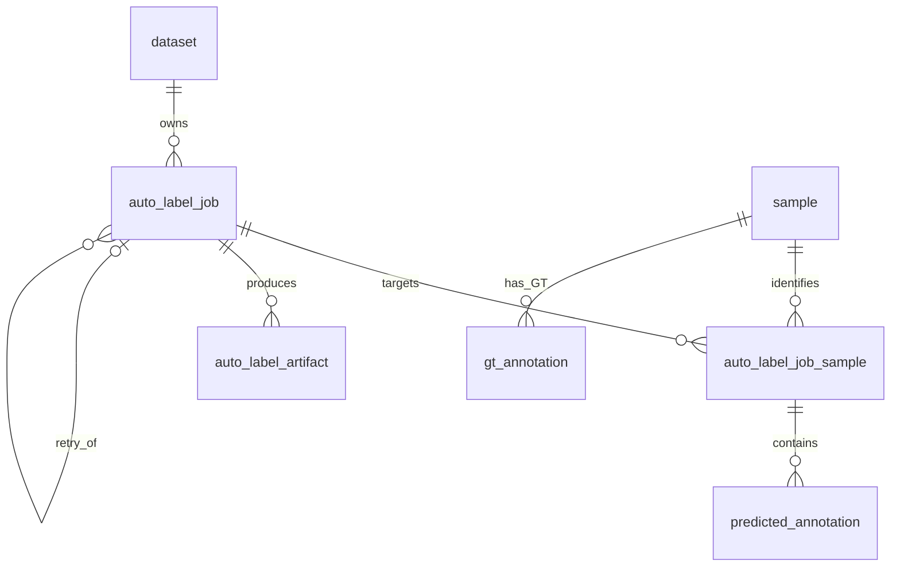

# Auto-label result schema draft

## 1. ER structure



All token relationships are dataset-scoped. A job belongs to one dataset and one class mapping. Scene targets are expanded into exact sample rows before AI dispatch. requested_targets records the requested scene/sample token array; those JSON tokens are an audit snapshot, not FK-enforced. Actual target membership is enforced by auto_label_job_sample -> sample -> scene. Spring validates target_type, requested targets, and the expanded list together.

## 2. Table and column definitions

### auto_label_job

| Columns | Meaning |
|---|---|
| id, dataset_id | Identity PK and existing dataset FK |
| request_key | Client idempotency key; unique within dataset |
| retry_of_job_id | Previous job in same dataset, nullable |
| target_type, requested_targets | SCENE/SAMPLE and nonempty array of requested tokens |
| model_name, model_version | VESPA and exact code commit/version |
| config_name, model_config | p_final.yaml and resolved configuration snapshot, including checkpoint identities |
| mapping_name, class_names | 1class/3class/8class and ordered output class list |
| coordinate_frame | WORLD; center in meters, quaternion WXYZ |
| score_type | VESPA_CONSTANT by default, MODEL_CONFIDENCE only when exporter supplies real model confidence |
| status | PENDING/RUNNING/COMPLETED/FAILED |
| execution_token | Spring-generated UUID for this AI dispatch; stale callback protection |
| result_checksum | SHA-256 of accepted canonical result, populated on completion |
| created_at, started_at, completed_at | TIMESTAMPTZ; completed_at is terminal time for either success or failure |
| failure_reason | Required nonblank text for FAILED |

### auto_label_job_sample

| Columns | Meaning |
|---|---|
| job_id, dataset_id, sample_token | Exact job membership; FK to same-dataset job and original sample |
| result_received_at | NULL means no accepted sample result; a timestamp with no prediction rows means zero detections |

### predicted_annotation

| Columns | Meaning |
|---|---|
| id | Independent prediction identity; never a GT annotation token |
| job_id, dataset_id, sample_token | Job and original sample association via target membership FK |
| box_index | Zero-based position in results[sample_token]; not an instance/track ID |
| detection_name | VESPA class; Spring also checks membership in this job's class_names |
| center_x/y/z | translation[0/1/2], world box center in meters; matches GT naming |
| size_w/l/h | size[0/1/2], width/length/height in meters |
| rotation_w/x/y/z | rotation[0/1/2/3], quaternion; VESPA exports yaw-only orientation |
| velocity_x/y | velocity[0/1], world planar velocity m/s; zero may also mean unestimated |
| detection_score | detection_score, currently constant 1.0 for VESPA; not calibrated confidence |
| attribute_name | Original string; currently empty |
| raw_payload | Original per-box JSON, same convention as existing catalog tables |
| created_at | DB insertion time |

### auto_label_artifact

| Columns | Meaning |
|---|---|
| id, job_id | Artifact identity and owning job |
| artifact_type | FINAL_JSON/RERUN/OTHER; multiple files allowed |
| storage_key, relative_path | Storage locator, following dataset storage_key/root_relative_path convention |
| checksum, content_type | Optional file integrity/type metadata |
| created_at | Registration time |

Artifact files themselves are stored outside PostgreSQL. Artifact deletion does not delete physical files. JSON may be retained as a file; raw_payload holds each parsed box.

## 3. FK / UNIQUE / INDEX

- job -> dataset; retry -> same-dataset job using (dataset_id, retry_of_job_id).
- target -> job using (dataset_id, job_id), and sample using (dataset_id, sample_token).
- prediction -> target using (dataset_id, job_id, sample_token). Rejects wrong datasets and samples outside the job.
- artifact -> job using job_id. Dataset is determined by its owning job.
- Unique (dataset_id, request_key) prevents duplicate job creation on API retransmission.
- Unique (job_id, sample_token, box_index) prevents duplicate box positions.
- Unique (job_id, storage_key, relative_path) prevents duplicate artifact registrations.
- Job deletion cascades to targets, predictions, artifacts. Original dataset/sample deletion is restricted by FKs. A retry referencing an earlier job restricts deletion of that earlier job.
- Indexes support queue polling (status, created_at), dataset job history, retry history, jobs for a sample, class-filtered sample predictions, and job artifacts by type. Job/sample box retrieval also uses the box UNIQUE index.
- CHECK constraints enforce lifecycle field consistency, finite centers/velocities/positive dimensions, score [0,1], and approximately unit quaternions (norm squared tolerance 0.001).

## 4. Spring ingestion and retry contract

1. Create PENDING job and freeze expanded sample targets in one transaction. request_key collisions return the existing job only if the normalized request is identical; otherwise return conflict.
2. Dispatch with Spring-generated execution_token; transition PENDING -> RUNNING atomically and set started_at. FastAPI receives job ID, token, targets and config, computes, and returns results. It has no DB writing role.
3. Spring validates matching job/token, mapping/config, exact sample key coverage (including [] for empty samples), per-box sample_token equal to its results key, class membership and finite numeric values.
4. Lock the job row with SELECT ... FOR UPDATE. Accept a new result only for RUNNING with matching token. In one transaction delete any previous prediction rows for this job, insert the full replacement, mark all targets received, register artifacts, and transition to COMPLETED with checksum and completed_at. Roll back all changes if anything fails. Do not merge a replacement using box_index UPSERT alone: removed boxes would survive.
5. A duplicate callback for COMPLETED with matching execution_token and result_checksum is a no-op. A conflicting checksum, stale token or callback for FAILED is rejected. Compute checksum from a deterministic canonical representation (stable sample ordering, stable box-array ordering), not arbitrary JSON whitespace.
6. An intentional computation retry creates a NEW job with a NEW request_key and retry_of_job_id pointing to the previous job. Keep previous job/results as history. Same-job redelivery is idempotent ingestion, not a new computation.
7. Only expose accepted results from COMPLETED jobs by default. FAILED stores reason and terminal time. Spring enforces allowed state transitions, at least one target, target immutability, exact class mapping, and all-sample completion; SQL CHECK constraints do not enforce cross-row lifecycle behavior.

Stock main_pseudo_vlm.py skips final submission writing for a subset of scenes. The AI adapter must serialize per-scene results for requested subsets; the DB schema does not change that exporter behavior. The existing final exporter also skips existing files: use a separate output directory per new job to avoid stale file reuse.

## 5. GT comparison

Use (dataset_id, sample_token) to select the same frame. Prediction and GT share world centers, WLH dimensions and WXYZ quaternion representation. No predicted_annotation -> gt_annotation FK: predictions are independent detections with no guaranteed GT match.

```sql
-- Prediction list for a completed job/sample. Named parameters are Spring parameters.
SELECT p.*
FROM predicted_annotation p
JOIN auto_label_job j ON j.id=p.job_id AND j.dataset_id=p.dataset_id
WHERE p.job_id=:jobId AND p.dataset_id=:datasetId
  AND p.sample_token=:sampleToken AND j.status='COMPLETED'
ORDER BY p.box_index;

-- Ground truth for the same dataset/sample.
SELECT a.*, c.name AS gt_category
FROM gt_annotation a
JOIN object_instance i ON i.dataset_id=a.dataset_id AND i.token=a.instance_token
JOIN category c ON c.dataset_id=i.dataset_id AND c.token=i.category_token
WHERE a.dataset_id=:datasetId AND a.sample_token=:sampleToken;
```

Map gt_category to the chosen VESPA class mapping before comparing. Match individual boxes by class/distance/IoU in application logic; joining solely on sample_token makes all pair combinations, not matched objects. GT velocity is not stored in the current gt_annotation schema. Predictions do not include GT instance_token, visibility or point counts. For VESPA-equivalent GT filtering, exclude num_lidar_pts + num_radar_pts = 0.

## 6. Flyway SQL draft and validation

Source: src/main/resources/db/migration/V4__auto_label_result.sql. Existing V1/V2/V3 migrations are unchanged. The draft becomes active on the next successful Flyway migration; it has not been applied to the existing DB in this task.

Validated on 2026-10-03 in an isolated pgvector/pgvector:pg16-trixie PostgreSQL 16 container, with no host ports or persistent volumes. V1-V4 executed successfully in order using psql ON_ERROR_STOP. Normal prediction/artifact insertion, PENDING -> RUNNING -> COMPLETED and FAILED field consistency, processed empty samples, GT separation, retry linkage, cascading deletion and transaction rollback passed. All 13 expected rejection checks passed: duplicate request/box/artifact, cross-dataset target/retry, untargeted sample, invalid size, NaN center, infinite velocity, nonunit quaternion, out-of-range score, premature completion and unknown status. Existing application databases were unchanged. The temporary container was removed after verification. This validates SQL execution and DB constraints; Flyway application startup and Spring callback/idempotency behavior still require integration testing after their implementation.
