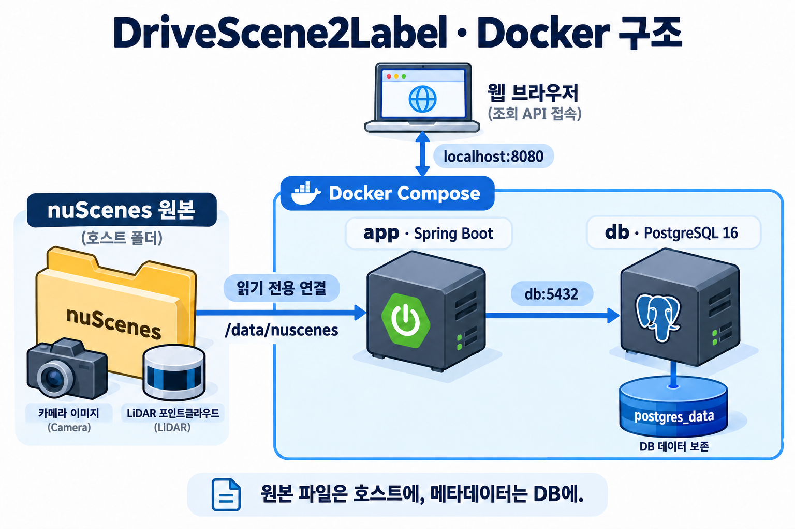
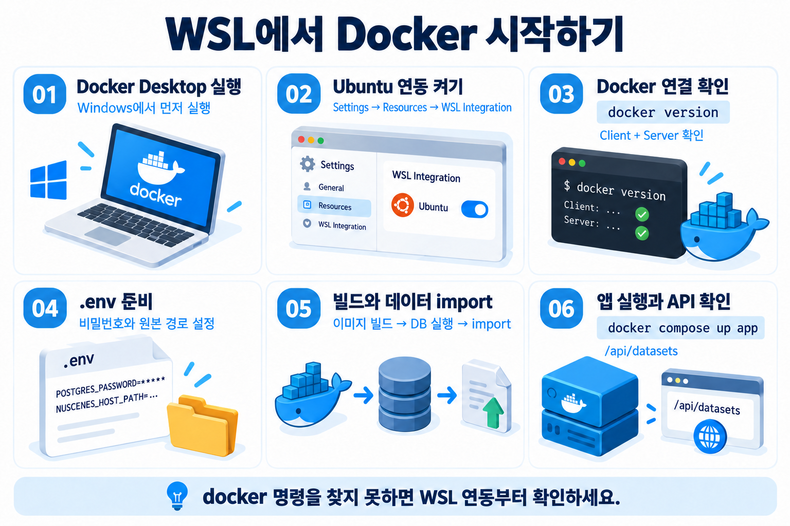

# nuScenes 프로젝트로 배우는 Docker

> **초기 학습 기록 (2026-10-01)** — 아래 구조·명령·검증 결과는 당시 기준입니다.
> 현재 gpu_local은 frontend·backend·ai-server·db 구성과 웹 업로드·GPU 추론을 사용합니다.
> 현재 설치·실행·포트·검증 범위는 [최신 README](../README.md)를 따르세요.

> DriveScene2Label 학습 정리 · 2026-10-01

## 1. 무엇을 Docker로 실행하나요?

기존에는 WSL에서 PostgreSQL을 직접 준비하고 Gradle로 Spring을 실행했습니다.
Docker 환경에서는 같은 기능을 app과 db 두 컨테이너로 실행합니다.
기존 로컬 실행 스크립트도 계속 사용할 수 있습니다.



| 구성 요소 | 역할 |
|---|---|
| app | Spring Boot 실행, JSON import, DB 조회, 원본 파일 응답 |
| db | PostgreSQL 16 실행, 메타데이터와 파일 상대경로 저장 |
| 호스트 nuScenes 폴더 | 사진·LiDAR·지도·원본 JSON 보관 |
| postgres_data | Docker DB 데이터 보존 |

현재 구현 범위는 데이터 import와 조회 API입니다. 라벨링 편집 화면은 포함하지 않습니다.

## 2. 이미지와 컨테이너는 어떻게 다른가요?

**이미지**는 프로그램과 실행 환경을 묶은 결과물입니다.
**컨테이너**는 그 이미지를 사용해 실제로 실행한 환경입니다.

Dockerfile은 이미지를 만드는 방법을 기록합니다.
우리 Dockerfile은 두 단계로 구성됩니다.

1. JDK 21에서 Gradle Wrapper로 실행 가능한 Spring Boot JAR를 만듭니다.
2. Java 21 JRE 이미지에 JAR만 복사하고 일반 사용자로 실행합니다.

`docker compose build`는 이미지를 만들고, `docker compose up`은 컨테이너를 생성·시작합니다.
Git에는 이 환경을 재현하는 Dockerfile과 Compose 설정을 올립니다.
실행 중인 컨테이너나 실제 DB 데이터 자체를 Git에 올리는 것은 아닙니다.

## 3. 파일별 역할

| 파일 | 하는 일 |
|---|---|
| Dockerfile | Spring 앱 이미지 빌드와 실행 방법 |
| compose.yml | app/db 환경변수, 네트워크, 포트, 저장 공간, 시작 조건 |
| .dockerignore | 빌드에 필요한 파일만 허용하고 원본 데이터·비밀번호·로컬 DB 제외 |
| .env.example | 환경변수 작성 예시 |
| .env | 각 개발자의 실제 비밀번호와 원본 경로. Git 제외 |
| README.md | 프로젝트 실행 안내 |

Spring 코드와 Flyway SQL은 기존 것을 사용합니다.
별도 테이블 생성 SQL을 Docker용으로 중복 작성하지 않았습니다.

## 4. 왜 DB 주소가 localhost가 아니라 db인가요?

컨테이너마다 자신의 localhost가 있습니다.
app 안에서 localhost에 접속하면 app 자신에게 접속합니다.
PostgreSQL은 다른 컨테이너에 있으므로 Compose 서비스 이름 `db`로 찾습니다.

```text
브라우저 → localhost:8080 → app
app → jdbc:postgresql://db:5432/drivescene → db
```

기본 설정에서 앱은 컨테이너 내부의 0.0.0.0:8080으로 요청을 받고,
호스트에는 127.0.0.1:8080으로 공개합니다.
DB의 5432는 Compose 내부에서 사용하며 호스트 포트는 열지 않았습니다.
기존 로컬 DB의 55432와 Docker DB는 서로 다른 실행 환경입니다.

## 5. 저장 공간 두 가지

### 원본 파일: 읽기 전용 bind mount

```text
호스트: /home/hyuksu/Cap_Project_Data/v1.0-mini
                       ↓ 읽기 전용 연결
app:    /data/nuscenes
```

기존 폴더를 컨테이너에서도 읽을 수 있게 연결합니다.
큰 원본 데이터를 이미지에 복사하지 않아 이미지 중복과 빌드 부담을 줄입니다.
컨테이너에서 이 연결을 통해 원본을 수정할 수는 없습니다.

### DB 데이터: named volume

`postgres_data`를 PostgreSQL의 `/var/lib/postgresql/data`에 연결합니다.
컨테이너를 지우고 다시 만들어도 이 volume이 남아 있으면 DB를 유지합니다.

**기존 .local/postgres의 DB와 Docker volume의 DB는 별개입니다.**
따라서 Docker DB에서는 최초 한 번 nuScenes import를 해야 합니다.

## 6. 이번 오류의 뜻과 해결

```text
The command 'docker' could not be found in this WSL 2 distro.
```

Ubuntu에서 Docker 명령을 사용할 수 없는 상태입니다.
이 메시지가 발생한 단계에서는 프로젝트 이미지 빌드나 Spring 실행이 시작되지 않았습니다.
Windows의 Docker Desktop 실행 상태와 Ubuntu WSL 연동을 먼저 확인합니다.



1. Windows 시작 메뉴에서 Docker Desktop을 실행합니다.
2. Settings → General에서 Use WSL 2 based engine을 확인합니다.
   환경에 따라 기본 적용되어 항목이 보이지 않을 수도 있습니다.
3. Settings → Resources → WSL Integration에서 Ubuntu를 활성화합니다.
4. Apply 또는 Apply & Restart를 누르고 적용을 기다립니다.
5. Ubuntu 터미널에서 아래 두 명령을 실행합니다.

```bash
docker version
docker compose version
```

docker version에 Client와 Server가 모두 표시되면 다음 단계로 진행합니다.
WSL Integration 메뉴가 없다면 Windows 컨테이너 모드인지 확인하고 Linux containers로 전환합니다.
이미지는 이해를 돕는 개념도이며 실제 설정 화면의 배치는 버전에 따라 다를 수 있습니다.

## 7. 처음 실행하는 순서

아래 명령은 Ubuntu 터미널의 프로젝트 루트에서 **한 단계씩 성공 여부를 확인하며** 실행합니다.

### ① .env 준비

```bash
# .env가 이미 있다면 덮어쓰지 않습니다.
[ -f .env ] || cp .env.example .env
nano .env
```

`POSTGRES_PASSWORD`를 개발용 비밀번호로 바꾸고,
`NUSCENES_HOST_PATH`를 실제 원본 데이터 폴더의 절대경로로 지정합니다.
루트 폴더 아래에 samples/, sweeps/, maps/, v1.0-mini/가 있어야 합니다.
nano에서 저장은 Ctrl+O → Enter, 종료는 Ctrl+X입니다.

기존 Spring 서버가 8080을 사용 중이면 해당 서버를 종료하거나 APP_PORT=8081로 변경합니다.

### ② 이미지 빌드

```bash
docker compose build
```

처음에는 Java 이미지와 Gradle 의존성을 내려받으므로 시간이 걸릴 수 있습니다.

### ③ DB 실행

```bash
docker compose up -d db
```

-d는 터미널을 점유하지 않고 백그라운드에서 실행한다는 뜻입니다.
DB의 healthcheck가 통과해야 app이 시작되도록 구성했습니다.

### ④ nuScenes import

```bash
docker compose run --rm app --spring.main.web-application-type=none --nuscenes.import.enabled=true
```

app 이미지로 일회성 컨테이너를 실행합니다.
Flyway로 테이블을 준비하고 원본 JSON을 읽어 DB에 저장합니다.
웹 서버는 띄우지 않으며 완료 후 종료합니다.
--rm은 일회성 컨테이너를 제거하는 옵션이고 DB volume은 그대로 남습니다.

### ⑤ 조회 서버 실행

```bash
docker compose up app
```

이제 Spring 조회 서버가 실행됩니다. 다른 터미널에서 API를 확인합니다.

```bash
curl --fail http://localhost:8080/api/datasets
```

APP_PORT를 8081로 바꿨다면 위 주소도 8081로 변경합니다.
데이터셋 목록에서 ID를 확인한 뒤 개수를 조회합니다.

```bash
# 실제 응답의 id가 1인 경우
curl --fail http://localhost:8080/api/datasets/1/stats
```

mini 전체 import의 예상 개수:

| 데이터 | 개수 |
|---|---:|
| scene | 10 |
| sample | 404 |
| sample_data | 31,206 |
| gt_annotation | 18,538 |
| map_asset | 4 |

목록이 []라면 서버가 빈 목록을 반환한 것입니다. 새 Docker DB에서 import가 성공했는지 먼저 확인합니다.

## 8. 다음부터 실행·확인·종료하기

```bash
# 최초 import 완료 후 일반 실행
docker compose up --build

# 컨테이너 상태 및 최근 로그
docker compose ps
docker compose logs --tail=100 app db

# 종료: DB 데이터 보존
docker compose down
```

**다음 명령은 DB volume까지 삭제합니다. DB를 초기화하려는 경우에만 실행하세요.**
다시 실행하려면 import가 필요하며 호스트의 nuScenes 원본은 삭제되지 않습니다.

```bash
docker compose down -v
```

.env의 비밀번호를 바꾸는 것만으로 기존 DB volume의 로그인 비밀번호가 변경되지는 않습니다.

## 9. 공부할 때 확인할 질문

- build는 무엇을 만들고 up은 무엇을 실행하는가?
- app 안의 localhost는 어디를 가리키는가?
- 원본 폴더 연결과 PostgreSQL volume은 각각 무엇을 보존하는가?
- Flyway의 테이블 생성과 JSON import는 어떤 차이가 있는가?
- down과 down -v의 차이는 무엇인가?

Flyway는 **테이블 구조**를 준비하고, import는 **원본 데이터의 내용**을 채웁니다.
일반 서버 실행은 import를 자동 수행하지 않습니다.

## 10. 검증 범위와 참고

Docker 구성을 추가할 때 기존 테스트 5개, 실행 JAR 빌드, Compose 설정 검사는 통과했습니다.
당시 Docker 엔진 및 WSL 연동을 사용할 수 없어 실제 컨테이너 빌드·기동은 검증하지 못했습니다.
이 문서의 예상 응답은 Docker 실행 성공을 확인한 결과와 구분해야 합니다.

- [Docker Desktop WSL 설정](https://docs.docker.com/desktop/features/wsl/)
- [Compose 시작 순서와 healthcheck](https://docs.docker.com/compose/how-tos/startup-order/)
- [Compose 서비스 설정](https://docs.docker.com/reference/compose-file/services/)
- [PostgreSQL 공식 이미지](https://hub.docker.com/_/postgres)
