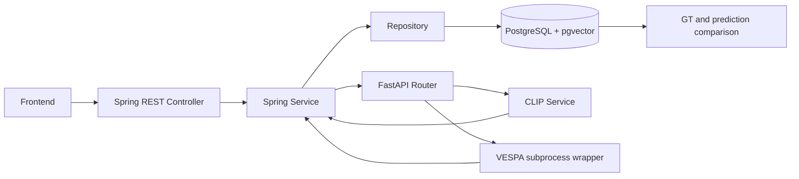

# Backend 통합 검증 및 mini 시나리오

2026-10-03 로컬 작업 기록. API의 최종 계약은 [README_API.md](../README_API.md). 원격 main은 `ffb6dc8`; 기존 작업을 유지한 채 부족한 연결을 추가했다. 이전 통합 검증 기록이며 최신 Docker 검증 결과는 [Docker 통합](docker-integration.md)을 참조한다. 프론트엔드는 수정하지 않았다.

## 수정 파일

이번 통합 점검에서 생성/수정:

- `src/main/java/com/example/demo/nuscenes/api/ImageEmbeddingController.java`: image inference/save REST 연결.
- `.../api/AutoLabelController.java`: results 조회, accepted 로그.
- `.../api/EmbeddingController.java`: 오래된 설명 수정.
- `.../api/ApiErrors.java`: validation/업무/DB 오류 응답.
- `.../client/TextEmbeddingClient.java`: 기존 RestClient 설정을 재사용한 image 호출.
- `.../service/ImageEmbeddingService.java`: camera/root 검사, skip/overwrite, 추론 후 저장.
- `.../service/EmbeddingValidator.java`: text/image 공통 model/preprocess/768/norm 검사.
- `.../service/SceneSearchService.java`: 공통 검사 재사용 및 검색 로그.
- `.../service/AutoLabelService.java`: 완료 결과 조회.
- `.../service/AutoLabelWorker.java`: 시작/완료/box count 로그.
- `.../repository/ImageEmbeddingRepository.java`: sample_data 식별 및 atomic upsert.
- `.../repository/AutoLabelRepository.java`: 결과와 artifact 조회.
- `.../dto/AutoLabelDtos.java`: 결과/box/artifact DTO.
- `src/test/java/com/example/demo/SceneSearchTests.java`, `AutoLabelTests.java`: 저장/조회/예외 통합 검증.
- `ai-server/main.py`, `services/vespa_service.py`: 요청 elapsed/status와 lifecycle/실행 로그.
- `ai-server/tests/test_vespa_wrapper.py`: 최종 JSON 누락 검증.
- `README.md`, `README_API.md`, 이 문서.

기존 구현 유지: CLIP shared core, CLI DB import, V4 migration, 검색 JOIN/aggregation, VESPA 외부 adapter, auto-label transaction. `...`는 위 Java nuscenes 경로의 줄임말이다. 작업 시작 전 존재한 compose/config/CLI 변경과 사용자 파일도 그대로 유지했다.

## 발견 및 수정

|발견|수정|
|---|---|
|FastAPI image API가 있어도 Spring에 write 경로 없음|POST sensor-file embedding, 모델 metadata와 vector 저장|
|완료 job 결과를 읽는 REST API 없음|GET jobs/{id}/results, 빈 sample/box/artifact 포함|
|text와 image 검증 복제로 drift 가능|동일 EmbeddingValidator 사용|
|프론트 오류 계약 불명확|업무·입력·DB 예외에 code/message 응답|
|성공 작업/추론 추적 정보 부족|job/scene/status/count 및 HTTP elapsed 로그|
|기존 설명이 CLI만 embedding 작성한다고 주장|Spring image writer를 반영|

## 검증 범위

### 자동 테스트

최종 실행: Spring 17개, FastAPI 17개 통과 (실패 0). `git diff --check` 통과.

실제 PostgreSQL(pgvector pg16)과 Spring 전체 context, Flyway V1~V4를 사용한다. AI HTTP 응답만 가짜 서버로 제공한다. 기존 DB/volume은 변경하지 않는다.

```bash
bash scripts/docker-test.sh
cd ai-server
.venv/bin/python -m pytest -q tests
```

검증 항목:
- image 상대경로/metadata 전달, STORED, 기존 SKIPPED 시 AI 미호출, overwrite 후 단일 행 유지 및 새 vector 저장.
- AI model/preprocess/차원/벡터 오류 거부, 없는 이미지404, 서버 연결 실패503.
- text JSON DTO 변환, `<=>` ranking, dataset 분리, MAX/AVERAGE/TOP_K_AVERAGE, keyframe 필터, topK, 빈 결과와 입력 오류.
- job PENDING→RUNNING→COMPLETED, FAILED, idempotency 충돌, 결과 sample coverage, 빈 sample 유지.
- 결과 API는 PENDING409, 완료200; 예측 box/좌표계/artifact 반환.
- DB trigger로 COMPLETED 갱신을 강제로 실패시켜 모든 box/artifact/sample receipt가 rollback되고 별도 transaction으로 FAILED가 저장됨.
- FastAPI: CLIP startup 실패, 이미지 경로/전처리, VESPA fake subprocess의 1/3/8class, 실행 실패, 잘못된 결과, 출력 누락, timeout kill, busy, unknown scene, 설정 누락,422.

DB 완전 중단 시 공통 예외 매핑은 코드 점검했다. 운영 DB를 정지하는 장애 실험은 하지 않았다. DB가 내려가면 FAILED 기록도 실패할 수 있다.

### 실제 모델 검증

실제 캐시된 `ViT-L-14-quickgelu/openai` + PyTorch CUDA로 FastAPI TestClient lifespan부터 실행했다.

- GET /health:200, device=cuda, CLIP ready.
- POST /embedding/text (`rainy night road`):200,768차원,norm=0.9999999695.
- POST /embedding/image:200,768차원,norm=0.9999999909,lr-square-crop-mean.
- 실제 mini 파일: `samples/CAM_FRONT/n015-2018-07-24-11-22-45+0800__CAM_FRONT__1532402927612460.jpg`.

이 모델 검증은 실제 Spring/DB까지 한 번에 연결한 live E2E가 아니다. Spring 저장 및 검색은 위 별도 HTTP/DB 통합 테스트로 검증했다. 실제 VESPA 전체 추론 또한 미실행이다. 현재 AI venv에서 nuscenes/open3d/groundingdino/segment_anything/cv2가 없음을 확인했다. 별도 VESPA 환경을 구축하고 VESPA_PYTHON을 지정해야 한다. CLIP venv에 VESPA 전체 dependency를 무리하게 합치지 않는다.

## mini 실제 End-to-End 실행 시나리오

### 준비

기존 metadata DB와 mini JPG/LiDAR 파일을 준비한다. FastAPI 및 Spring에 같은 mini root를 설정하고 DB import는 기존 importer/README 절차를 사용한다. 환경 변수의 DB 비밀번호는 문서나 로그에 쓰지 않는다.

WSL에서 FastAPI (project root 기준):

```bash
export NUSCENES_ROOT=/home/hyuksu/Cap_Project_Data/v1.0-mini
export CLIP_IMAGE_ROOT="$NUSCENES_ROOT"
export VESPA_DATA_ROOT="$NUSCENES_ROOT"
export VESPA_DATASET_VERSION=v1.0-mini
export VESPA_ROOT="$PWD/.local/VESPA"
# 아래는 실제 설치한 VESPA 별도 가상환경 경로로 바꾼다.
export VESPA_PYTHON=/absolute/path/to/vespa-env/bin/python
export HF_HOME="$PWD/.local/clip-model-cache"
cd ai-server
.venv/bin/python -m uvicorn main:app --host 127.0.0.1 --port 8000 --workers 1
```

Spring 별도 terminal:

```bash
export AI_SERVER_BASE_URL=http://127.0.0.1:8000
export VESPA_DATASET_VERSION=v1.0-mini
# 기존 DB에 맞춰 DB_URL, DB_USERNAME, DB_PASSWORD 설정
# Compose DB의 host 포트는 55433, application 기본값은 55432이므로 명시적으로 맞춘다.
sh gradlew bootRun
```

Compose Spring에서 host AI에 접근하는 경우 AI_SERVER_BASE_URL=host.docker.internal:8000 설정 및 실제 host/WSL 네트워크 접근이 가능해야 한다. 위 loopback 실행 예시는 Spring도 같은 WSL에서 실행하는 경우다. 외부 접근 바인딩 변경 시 내부망으로 제한한다.

### 호출과 기대 결과

```bash
curl http://localhost:8000/health
curl http://localhost:8080/api/datasets
# 아래 ID는 앞선 API의 실제 ID로 바꾼다.
curl http://localhost:8080/api/datasets/1/scenes
curl 'http://localhost:8080/api/scenes/7/samples?limit=100'
curl http://localhost:8080/api/samples/30
curl -X POST http://localhost:8080/api/sensor-files/42/embedding
curl -X POST http://localhost:8080/api/sensor-files/42/embedding
curl -X POST 'http://localhost:8080/api/sensor-files/42/embedding?overwrite=true'
curl --get http://localhost:8080/api/search/scenes --data-urlencode 'q=rainy night road' --data 'datasetId=1&k=10'
curl -X POST http://localhost:8080/api/auto-label/jobs -H 'Content-Type: application/json' -H 'Idempotency-Key: mini-scene-0061-run-1' -d '{"sceneToken":"REPLACE_WITH_SCENE_TOKEN","datasetId":1,"classMode":8}'
curl http://localhost:8080/api/auto-label/jobs/12
curl http://localhost:8080/api/auto-label/jobs/12/results
curl http://localhost:8080/api/samples/30/annotations
```

1. scene 내 여러 camera ID의 embedding을 준비한다. 첫 저장 STORED, 두 번째 SKIPPED, overwrite STORED와 DB count 불변을 확인한다.
2. 검색 응답 scene별 중복이 없고 score 내림차순, k개 이하인지 확인한다. mini에 충분한 야간/우천 scene이 없을 수 있어 의미적으로 만족하는 결과를 보장하지 않는다.
3. 생성 후202/PENDING. 상태 polling으로 RUNNING→COMPLETED 확인, 이후 결과200. 실제 반환된 jobId를 사용한다.
4. results.sampleTokens가 해당 scene sample과 같고 빈 sample도 존재하는지 검사한다. 좌표 WORLD, quaternion WXYZ, sizeWLH 확인.
5. 동일 키 재요청은 같은 jobId. 새 키와 classMode1/3으로 별도 실행해 class set 확인.
6. AI 중단: 검색503, 새 auto-label FAILED 및 errorMessage. 잘못된 classMode2는400; 없는 scene404; 결과 완료 전409.
7. 별도 테스트 환경에서 VESPA timeout을 짧게 설정해504→Spring FAILED 확인. 테스트 후7200/7300 설정 복원.

### DB 검증 (read only)

```sql
SELECT dataset_id,sample_data_token,model_name,preprocess,count(*)
FROM image_embedding GROUP BY 1,2,3,4 HAVING count(*)>1;
-- 0 rows expected
SELECT id,status,failure_reason FROM auto_label_job ORDER BY id DESC LIMIT 10;
SELECT p.job_id,p.sample_token,count(*) FROM predicted_annotation p
JOIN sample s ON s.dataset_id=p.dataset_id AND s.token=p.sample_token
GROUP BY 1,2;
-- GT remains in gt_annotation; no prediction insert targets it.
```

## 당시 운영 전 남은 문제 (최신 Docker 검증 결과는 별도 문서 참조)

- 실제 VESPA dependency/weights 및 mini full inference 검증.
- 실제 Spring→FastAPI real CLIP→DB를 단일 live stack으로 실행하는 smoke test.
- RUNNING 작업의 crash recovery/lease/retry/cancel 미구현. DB 장애 시 상태 복구도 필요.
- artifact 다운로드/외부 storage 연동, 큰 결과 pagination 미구현.
- GT API class name JOIN 미제공; 현재 비교는 geometry 중심.
- CLIP 한국어 retrieval 품질/정확도 평가, 다중 worker 용량 정책 미검증.
- text/image 처리시간과 검색 대량 데이터 latency 측정 필요. pgvector 인덱스 최적화는 workload 기준 후속 검토.

## 발표용 architecture 설명



Spring은 시스템의 데이터 소유자다. 사용자 요청을 검증하고 metadata 조회, embedding 저장 및 scene 검색, job 상태와 예측 결과 저장을 담당한다. FastAPI는 모델 추론만 담당한다. 이미지는 기존 CLIP 전처리를 거쳐 768차원 정규화 벡터가 되고, 텍스트는 같은 CLIP 공간으로 변환된다. Spring은 cosine distance를 scene 단위로 집계해 검색 결과를 반환한다.

사용자가 scene을 선택하면 Spring이 PENDING job과 대상 sample을 저장한다. worker는 긴 DB transaction 없이 FastAPI의 VESPA wrapper를 호출한다. 최종 JSON을 받은 후 sample과 좌표/클래스 계약을 검증하고 예측 box, artifact, COMPLETED를 한 번에 commit한다. 오류가 나면 결과를 rollback하고 FAILED로 기록한다. GT는 독립 테이블에 보존하며 datasetId와 sampleToken으로 예측과 같은 프레임을 연결한다. 프론트엔드는 REST polling으로 상태를 확인한다.
